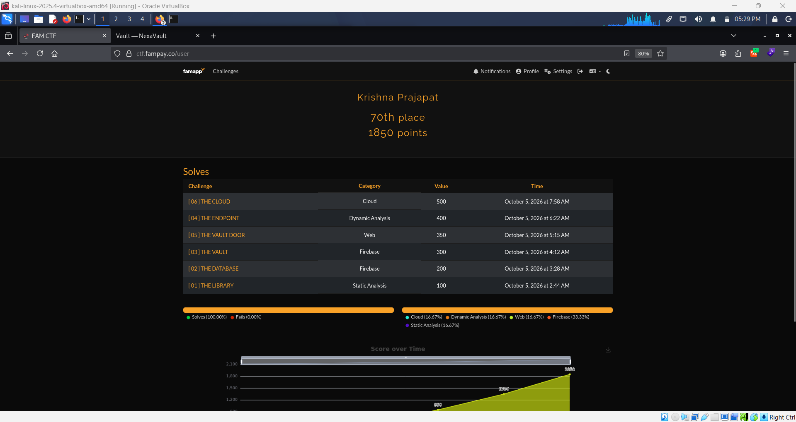

# FAM CTF – Security CTF Write-ups


# FamPay NexaVault CTF - Security Methodology & Write-ups
**Author:** Krishna Prajapat | **Score:** 1850/1850 (100% Solved) | **Rank:** 70th


> **Note:** Sensitive challenge flags and private challenge-specific secrets have intentionally been omitted.

---

# FAM CTF – 01 THE LIBRARY

##  Objective

The objective was to perform static analysis of an Android application and identify sensitive information accidentally exposed inside the APK.

## 1. APK Decompilation

The APK was analyzed using **JADX-GUI** and related Android reverse-engineering tools.

The objective was to inspect:

* Decompiled Java/Kotlin classes
* `AndroidManifest.xml`
* Application resources
* Configuration files
* Embedded strings

  

## 2. Static Analysis

A global search was performed for interesting keywords and sensitive patterns such as:

```text
FAM{
password
secret
token
key
api
flag
```

Application resources and internal classes were reviewed for hardcoded information.


## 3. Sensitive Data Discovery

The analysis revealed sensitive challenge-related information embedded directly inside the application.

Since APK files can be extracted and reverse-engineered, this information could be recovered without executing the application normally.

## 🔗 Attack Chain

```text
APK
↓
JADX Decompilation
↓
Source & Resource Analysis
↓
Keyword / String Search
↓
Identify Hardcoded Information
↓
Challenge Completion
```

## Key Takeaway

Sensitive information such as passwords, API keys, secrets, and other security-critical data should never be hardcoded inside client-side applications.

---


# FAM CTF – 02 THE DATABASE

##  Objective

The objective was to identify the application's Firebase backend configuration and test whether the database was improperly exposed.

## 1. Firebase Configuration Discovery

During application analysis, Firebase-related configuration was identified from the application's resources/configuration.

The Firebase project information and database endpoint were extracted for further testing.

## 2. Database Endpoint Testing

The Firebase Realtime Database endpoint was tested using direct HTTP requests.

A typical Realtime Database request follows the structure:

```text
https://<firebase-project>.firebaseio.com/.json
```

## 3. Security Rules Analysis

The response indicated that database data could be accessed without the expected authentication controls.

This demonstrated a **Firebase database security-rule misconfiguration**.

## 4. Data Exposure

Once unauthorized read access was confirmed, the accessible database structure and stored data were inspected to identify the challenge-specific information.

## 🔗 Attack Chain

```text
APK Analysis
↓
Firebase Configuration Discovery
↓
Identify Database Endpoint
↓
Test Unauthenticated Access
↓
Firebase Security Rule Misconfiguration
↓
Database Data Exposure
```

## Key Takeaway

Firebase Security Rules must be configured according to the application's actual authorization requirements. Public read/write permissions can result in complete database exposure.

---

# FAM CTF – 03 THE VAULT

##  Objective

The objective was to investigate a Firebase-backed application and identify whether a restricted or hidden data location could be accessed due to an authorization/configuration weakness.

## 1. Application Analysis

The application and its Firebase references were inspected to understand:

* Database structure
* Referenced paths
* Authentication requirements
* Potentially sensitive nodes

## 2. Hidden/Restricted Resource Identification

Rather than relying only on the database root, individual application references and database paths were analyzed.

A specific vault-related location was identified as a potentially interesting target.

## 3. Targeted Access Testing

The identified Firebase path was tested directly instead of assuming that restrictions on the root database applied equally to every child resource.

This highlighted the importance of checking authorization at the individual resource level.

## 4. Data Retrieval

The accessible vault resource returned challenge-specific data, confirming that the application's Firebase authorization model was not sufficiently restrictive.

## 🔗 Attack Chain

```text
Application Analysis
↓
Firebase References
↓
Identify Interesting Database Path
↓
Targeted Access Testing
↓
Authorization Misconfiguration
↓
Restricted Data Exposure
```

## Key Takeaway

Securing only the database root is not sufficient. Firebase authorization rules must be carefully applied to every sensitive collection, node, and operation.

---

# FAM CTF – 04 THE ENDPOINT

##  Objective

The objective was to analyze an Android application's native security mechanism and bypass client-side signature protection to obtain authorized access to the target API.

## 1. Static Analysis

The APK was decompiled using **JADX-GUI**.

During analysis, the API authentication mechanism and the custom `X-Signature` header were identified.

Signature generation was implemented inside the native library:

```text
libfam.so
```

The relevant signature-generation logic was associated with the native `computeSignature` functionality.

## 2. Native Security Analysis

Direct manipulation of the API request resulted in an authorization failure.

Because the signature was generated locally by the application, the next step was to observe and manipulate the logic during runtime.

## 3. Dynamic Instrumentation

**Frida** was used for runtime analysis.

The relevant signature-generation method/function was hooked to understand how the application generated the required authentication value.

Runtime manipulation allowed a valid signature to be generated for the required input.

## 4. API Access

The generated signature was observed and then tested against the API request using **Burp Suite**.

The server accepted the valid signature and returned the successful challenge response.

## 🔗 Attack Chain

```text
APK
↓
JADX Static Analysis
↓
Identify X-Signature
↓
Locate libfam.so
↓
Analyze computeSignature
↓
Frida Dynamic Hooking
↓
Generate Valid Signature
↓
Burp Suite Request Manipulation
↓
Authorized API Response
```

## Key Takeaway

Client-side native code should not be treated as a trusted security boundary. Even when authentication logic is moved into a native library, an attacker can reverse-engineer or instrument the client.

Critical authorization decisions must always be enforced server-side.

---

# FAM CTF – 05 THE VAULT DOOR

##  Objective

The objective was to analyze a web application's access-control mechanism and identify a way to reach functionality that was intended to be restricted.

## 1. Web Application Reconnaissance

The application was first explored normally to understand its available pages, endpoints, authentication flow, and request structure.

**Burp Suite** was used to intercept and inspect HTTP traffic.

## 2. Authentication & Authorization Analysis

Requests, parameters, cookies, and access-control behaviour were analyzed to understand how the application determined whether a user was authorized to access the protected functionality.

Different request conditions were tested to identify inconsistencies in the authorization mechanism.

## 3. Access-Control Bypass

A weakness in the application's access-control implementation was identified and used to reach the restricted vault functionality.

The important observation was that the server did not enforce the intended authorization boundary correctly.

## 4. Restricted Resource Access

After bypassing the relevant access-control mechanism, the protected vault functionality became accessible and the challenge was completed.

## 🔗 Attack Chain

```text
Web Application
↓
Endpoint Discovery
↓
Burp Suite Traffic Analysis
↓
Authentication / Authorization Analysis
↓
Identify Access-Control Weakness
↓
Bypass Restriction
↓
Access Protected Resource
```

## Key Takeaway

Authentication and authorization are different security controls. A web application must verify permissions server-side for every sensitive request rather than trusting client-side state, parameters, or session information.

---

# FAM CTF – 06 THE CLOUD

##  Objective

The objective was to exploit an exposed cloud debug interface and ultimately access a restricted S3 object using the EC2 instance's IAM permissions.

## 1. Debug Endpoint Discovery

The exposed NexOps dashboard revealed several useful endpoints:

```text
/status
/metrics/system
/metrics/config
/metrics/endpoints
/internal/webhook
```

The configuration endpoint exposed valuable cloud information, including the EC2 metadata endpoint and S3 storage configuration.

## 2. SSRF Discovery

The `/internal/webhook` endpoint performed server-side requests to supplied URLs.

Direct access to the metadata IP was restricted, but the application's hostname validation allowed an alternative AWS metadata hostname.

This resulted in an **SSRF → AWS IMDS** attack path.

## 3. IMDSv2 Access

The AWS Instance Metadata Service was accessed through the SSRF functionality.

An IMDSv2 token was obtained and then used to query the instance metadata endpoints.

The instance's IAM role was discovered through:

```text
/latest/meta-data/iam/security-credentials/
```

## 4. IAM Credential Retrieval

The discovered IAM role's metadata endpoint returned temporary AWS credentials.

These credentials were scoped to the challenge environment.

## 5. S3 Enumeration

The S3 bucket identified earlier was accessed using the temporary credentials.

Because AWS Signature Version 4 authentication was required, the request was manually signed using the retrieved temporary credentials.

Bucket enumeration revealed the challenge-specific object under the player's storage prefix.

## 6. Object Retrieval

A signed request for the identified S3 object was sent through the SSRF webhook.

The server successfully retrieved the object and returned its contents.

## 🔗 Attack Chain

```text
Exposed Debug Dashboard
↓
Discover /internal/webhook
↓
SSRF
↓
AWS IMDSv2
↓
IAM Role Discovery
↓
Temporary AWS Credentials
↓
AWS Signature V4
↓
S3 Bucket Enumeration
↓
Restricted Object
↓
Challenge Completion
```

## Key Takeaway

SSRF in cloud environments can have severe consequences. If an attacker can reach the EC2 Instance Metadata Service, they may be able to obtain temporary IAM credentials and use the instance's permissions to access cloud resources.

Production systems should restrict unnecessary debug endpoints, validate outbound requests securely, and use appropriate IMDS protections and least-privilege IAM policies.

---

# 🏁 Overall Learning

These challenges covered multiple areas of practical application security:

```text
01 → Android Static Analysis
02 → Firebase Security Misconfiguration
03 → Firebase Authorization
04 → Native Code + Frida
05 → Web Authentication / Access Control
06 → SSRF + AWS IMDS + IAM + S3
```

The biggest takeaway across the challenges is that **security controls should always be enforced on the server/backend side**. Client-side code, exposed debug functionality, weak Firebase rules, and improperly protected cloud metadata can all become attack surfaces.
